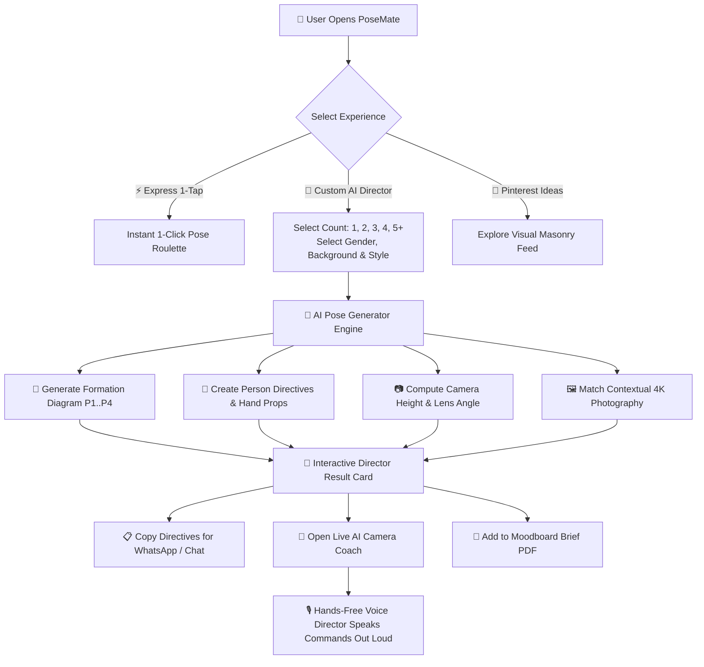
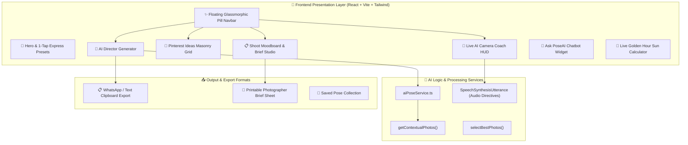

# 📸 PoseMate — AI Photographer & Pose Director

> **Never ask *"How should we pose?"* or *"What do I do with my hands?"* again.**

[](http://splendorous-platypus-63fc80.netlify.app)
[](https://github.com/ishitasheraji/posely)

PoseMate is an end-to-end **AI Photographer & Director** that transforms awkward photo shoots into effortless, high-end photography sessions. It tells everyone exactly where to stand, how to angle their body, where to place their hands, what camera lens to use, and speaks instructions out loud in real time while your phone rests on a tripod.

- 🌐 **Live Web Deployment**: [http://splendorous-platypus-63fc80.netlify.app](http://splendorous-platypus-63fc80.netlify.app)
- 🐙 **GitHub Repository**: [https://github.com/ishitasheraji/posely](https://github.com/ishitasheraji/posely)

---

## 🚨 The Problem

1. **Photo Freeze & Awkward Posing**: 90% of people freeze in front of a camera, wondering where to look or what to do with their hands.
2. **Unbalanced Group Dynamics**: Group photos frequently suffer from clutter, hidden faces, closed eyes, or stiff lineup postures.
3. **Pinterest Inspiration Gap**: People save aesthetic Pinterest photos but lack actionable technical directives (camera height, lens angle, sun direction, framing).
4. **Tripod Solo / Group Shoot Friction**: When taking solo or group photos on a tripod, walking back and forth to check the camera screen ruins candid energy.

---

## 💡 Proposed Solution

PoseMate acts as a personal **AI Director in your pocket**:
- **Visual Stand Diagrams**: Generates step-by-step posture blueprints with exact stand positions (`P1`, `P2`, `P3`, `P4`).
- **Person-by-Person Directives**: Detailed posture, hand placement, eye contact, and expression guides tailored to subject gender and group size.
- **Camera & Lighting Technical Specs**: Recommends exact camera height (e.g. *Chest Level 1.4m*), lens focal length (e.g. *50mm 2x Portrait*), and golden hour sun angles.
- **Hands-Free Voice Directing**: Speaks commands out loud while you shoot.

---

## 🔄 User Journey & Workflow Diagram



---

## 🏗️ System Architecture & Component Flow



---

## ⭐ Unique Selling Propositions (USPs)

| Feature | Description |
| :--- | :--- |
| 🎙️ **Hands-Free Voice AI Director** | Real-time spoken posture commands via **Web Speech Synthesis** (*"Person 2 step 20cm right!"*), allowing hands-free tripod shooting. |
| 💬 **Ask PoseAI Assistant Chatbot** | Persistent interactive AI chatbot widget for real-time photography, lighting, and pose advice. |
| 👥 **Dedicated 1, 2, 3, 4 & 5+ People Engines** | Dedicated stand positions, directives, and high-definition photography tailored to exact group counts. |
| 📌 **Pinterest-Style Inspiration Hub** | Staggered 4-column visual masonry grid with 1-click **Save Pin** overlays and split-view inspect modals. |
| 📋 **Shoot Brief & Moodboard Studio** | Curate visual pins, outfit color swatches, shot list checklists, and export a 1-page **Photographer Brief PDF**. |
| 👜 **Recommended Props for Natural Hands** | Context-aware accessory suggestions (*Coffee Mugs, Sunglasses, Jackets*) to eliminate awkward hand placement. |
| 🌅 **Live Golden Hour & Sun Calculator** | Live lighting calculator displaying sun status, rim light advice, and lens recommendations based on local time. |
| ✨ **Floating Glassmorphic Pill Navbar** | Modern glassmorphism floating header with tab icons, glowing active tab indicators, and quick-launch AI camera button. |

---

## 🛠️ Tech Stack

- **Frontend Core**: React 18, TypeScript, Vite
- **Styling & Design**: Vanilla CSS Design Tokens, Tailwind CSS, Glassmorphism & Mesh Gradients
- **Icons**: Lucide React
- **Audio Engine**: Web Speech Synthesis API
- **Routing & Config**: `vercel.json` (Vercel SPA rewrite) & `public/_redirects` (Netlify SPA fallback)

---

## 🚀 Getting Started

### Prerequisites
- Node.js (v18 or higher)
- npm or yarn

### Installation
```bash
# Clone the repository
git clone https://github.com/ishitasheraji/posely.git

# Navigate to project directory
cd posely

# Install dependencies
npm install

# Start development server
npm run dev
```

The app will be running live at **http://localhost:5173/**.

### Production Build
```bash
# Build production bundle
npm run build

# Preview production build locally
npm run preview
```

---

## ☁️ Deployment

### 1-Click Vercel Deployment
PoseMate is pre-configured with `vercel.json` for seamless Vercel SPA routing:
```bash
npx vercel
```

### Netlify Deployment
PoseMate includes `public/_redirects` for Netlify SPA routing:
```bash
npx netlify deploy --prod --dir=dist
```

---

## 📄 License

This project is licensed under the **MIT License**.

Developed with ❤️ by [Ishita Sheraji](https://github.com/ishitasheraji).
